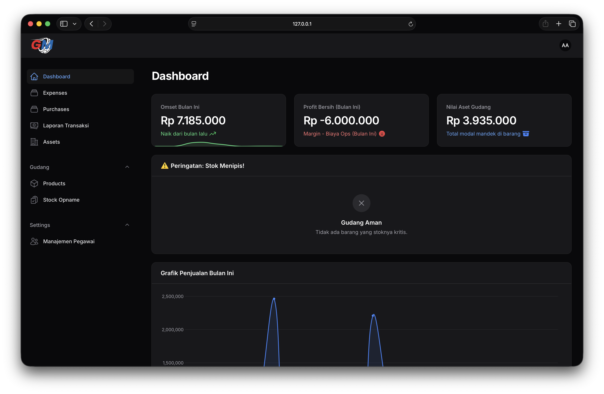
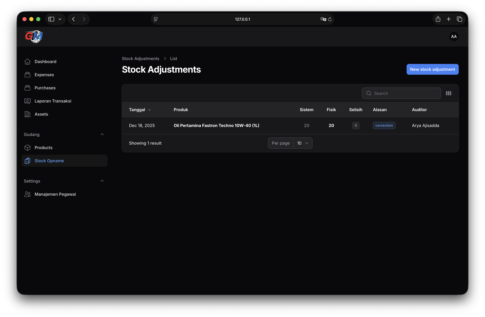
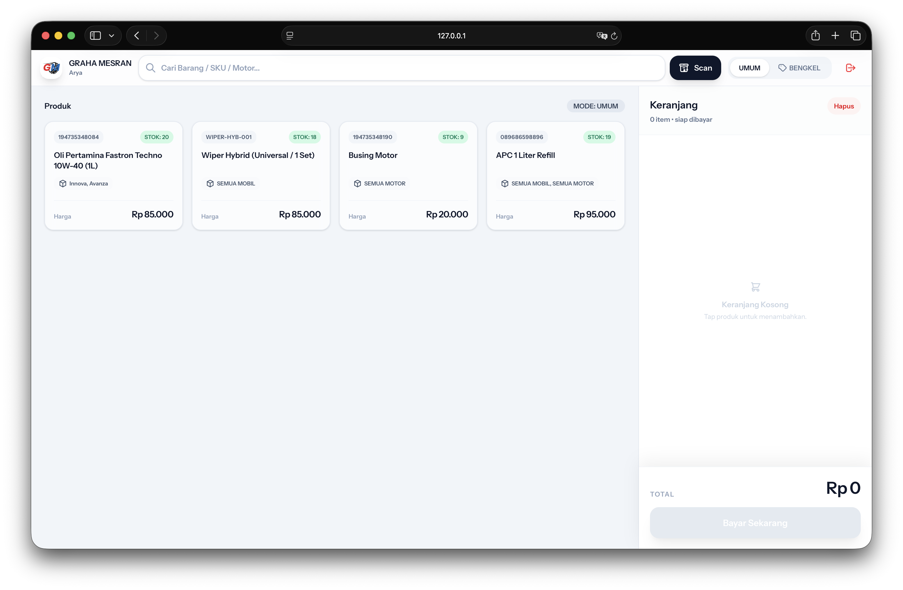
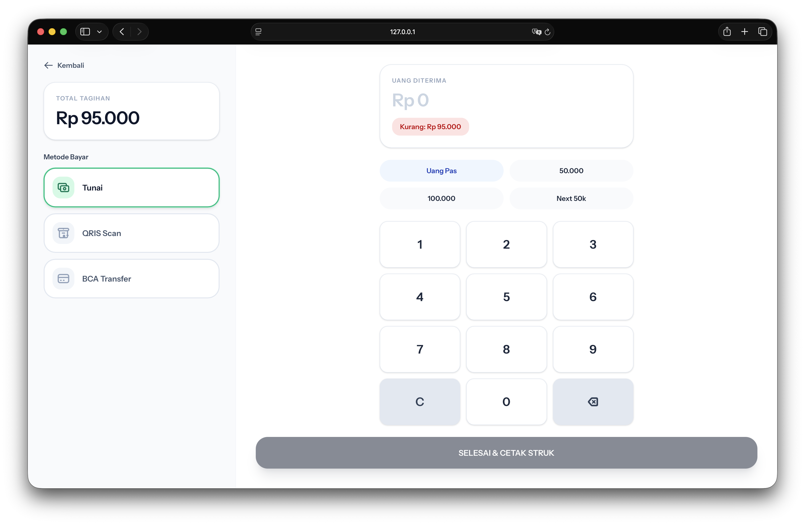

# 🔧 Graha Mesran POS (Point of Sales)


[](https://laravel.com)
[](https://filamentphp.com)
[](https://reactjs.org)
[](https://tailwindcss.com)

## 📖 Tentang Proyek

**Graha Mesran POS** adalah sistem Point of Sale (Kasir) modern dan komprehensif yang dirancang khusus untuk toko otomotif yang berfokus pada penjualan suku cadang (sparepart) dan pelumas Pertamina.

Berbeda dengan sistem kasir pada umumnya, aplikasi ini berfokus pada **Kesehatan Inventaris** dan **Kecerdasan Finansial**. Sistem ini dibangun untuk mengatasi kekacauan yang sering terjadi di bengkel: stok hilang ("tuyul"), arus kas yang tercampur antara pembelian aset vs biaya operasional, dan margin keuntungan yang tidak terpantau.

Dibangun dengan **Arsitektur Hybrid**:
* **Backend & Panel Admin:** Laravel Filament (untuk pelaporan & manajemen data yang kuat).
* **Frontend Kasir:** React.js via Inertia (untuk pengalaman kasir yang cepat, responsif, layaknya aplikasi native).

---

## 🔥 Fitur Unggulan

### 💰 Kecerdasan Finansial (Panel Admin)
* **Dashboard Real-time:** Pantau Profit Bersih, Omset Kotor, dan Nilai Aset Gudang secara instan dalam satu layar.
* **Logika Pengeluaran Otomatis:** Pembelian aset (seperti etalase) otomatis tercatat dan menyesuaikan saldo kas tanpa perlu input ganda (double-entry).
* **Pelacakan Profit:** Menghitung margin keuntungan per transaksi secara otomatis berdasarkan Harga Modal (HPP) yang dinamis.
* **Ekspor Excel:** Laporan lengkap siap audit untuk kebutuhan tutup buku bulanan.

### 📦 Kontrol Inventaris (Gudang)
* **Stock Opname (Audit):** Modul khusus untuk mencatat selisih stok fisik vs sistem (Hilang/Rusak/Koreksi) dengan validasi warna.
* **Manajemen Aset:** Memisahkan nilai peralatan toko (inventaris) dari nilai barang dagangan agar valuasi bisnis akurat.
* **Logika Produk:** Menangani karakteristik barang *fast-moving* (Oli) dan *slow-moving* (Sparepart).

### 🛒 Pengalaman Kasir Modern (POS)
* **Checkout Cepat:** Antarmuka berbasis React yang dioptimalkan untuk kecepatan input transaksi.
* **Siap PWA (Mobile):** Dapat diinstal di tablet Android/iOS layaknya aplikasi native dengan dukungan icon dan splash screen.
* **Branding Mode Ganda:** Antarmuka otomatis beradaptasi dengan Mode Terang (Siang) dan Mode Gelap (Malam).
* **Cetak Termal:** Tata letak struk yang presisi untuk printer standar 58mm/80mm.

---

## 📸 Tangkapan Layar

| Dashboard Admin | Stock Opname |
|:---:|:---:|
|  |  |

| Antarmuka Kasir | Opsi Pembayaran |
|:---:|:---:|
|  |  |

*(Catatan: Gambar di atas adalah data dummy untuk keperluan demonstrasi)*

---

## 🛠️ Teknologi yang Digunakan

* **Framework:** Laravel 11
* **Panel Admin:** FilamentPHP v3
* **Frontend:** React.js (Inertia.js)
* **Styling:** Tailwind CSS
* **Database:** MySQL
* **Deployment:** Hostinger (Kompatibel dengan Shared Hosting)

---

## 🚀 Instalasi (Development Lokal)

1.  **Clone repositori ini**
    ```bash
    git clone [https://github.com/leanderarya/grahamesran.git](https://github.com/leanderarya/grahamesran.git)
    cd grahamesran
    ```

2.  **Install Dependencies**
    ```bash
    composer install
    npm install
    ```

3.  **Pengaturan Environment**
    ```bash
    cp .env.example .env
    php artisan key:generate
    ```
    *Sesuaikan kredensial database Anda di file `.env`.*

4.  **Migrasi Database & Seeder**
    ```bash
    php artisan migrate --seed
    ```
    *Perintah ini akan membuat akun Super Admin default.*

5.  **Build Aset & Jalankan**
    ```bash
    npm run build
    php artisan serve
    ```

6.  **Akses Aplikasi**
    * Panel Admin: `http://127.0.0.1:8000/admin`
    * Kasir POS: `http://127.0.0.1:8000/`

---

## 🔮 Peta Jalan Pengembangan (Roadmap)

* [ ] **V1.1:** Integrasi Barcode Scanner & Fitur "Hold Transaction" (Simpan Sementara).
* [ ] **V1.2:** Database Supplier & Perhitungan HPP Rata-rata (Average Costing).
* [ ] **V1.3:** Loyalitas Pelanggan & Riwayat Servis (Rekam Jejak Kendaraan).

---

## 📝 Lisensi

Proyek ini adalah perangkat lunak open-source yang dilisensikan di bawah [lisensi MIT](https://opensource.org/licenses/MIT).

---

<p align="center">
  Dibuat dengan ❤️ oleh Arya Ajisadda Haryanto untuk Graha Mesran
</p>